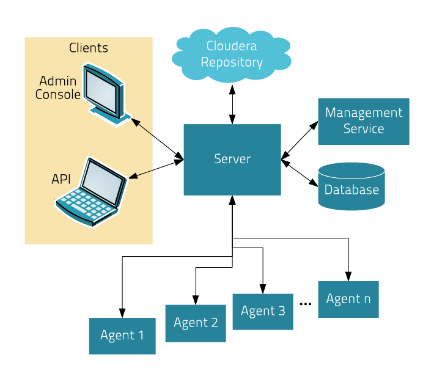

<!-- CSS work goes here for the time being -->
<!-- set a:link text-decoration to none -->
<!-- set a:hover text-decoration to underline -->
<!-- http://forums.markdownpad.com/discussion/143/include-pdf-pagebreak-instructions-in-markdown/p1 -->

---

## 
 <a name="cm_cdh_installation_section"/>Cloudera Manager & CDH Installation

* <a href="#install_methods">Installation Methods</a>
* <a href="#parcels">Understanding Parcels</a>
* <a href="#db_setup">Embedded vs. external database</a>
* <a href="#cm_cdh_key_points">Supplemental CM/CDH Points</a>
* <a href="#cm_ui_overview">Cloudera Manager UI Overview</a>

---

## 
 <a name="install_methods"/> CM/CDH Installation

* We use Cloudera Manager in several capacities:
  * Deploy EDH, Kafka, or Key Trustee clusters
  * Monitor the health of managed nodes and Hadoop services
  * Modify and monitor property settings
  * Expedite complex tasks, including:
    * Updating Cloudera Manager server and agent software
    * Setting up HDFS NameNode for high availability
    * Integrating security & LDAP-based services
    * Configuring & enabling HDFS Encryption

---

## 
 CM high-level architecture 

  

---

## 
 CM features 

* The Cloudera Manager server provides
  * An administrative console
  * Links to Hadoop package and parcel repositories
  * Management Services: reports, logging, auditing
    * A database server is needed to support some of these functions
  * Host and Service monitoring

---

## 
 <a name="cm_install_paths"/>Cloudera's supported installation paths

* [Path A: One-stop binary installer](http://www.cloudera.com/content/cloudera/en/documentation/core/latest/topics/cm_ig_install_path_a.html)
    * Useful for short-term, throwaway projects
    * Use an embedded PostgreSQL server
* [Path B: Manual setup for CM and its database](http://www.cloudera.com/content/cloudera/en/documentation/core/latest/topics/cm_ig_install_path_b.html)
    * Any cluster that will stand for more than 3-6 months
    * Supports Oracle, MySQL/MariaDB, and PostgreSQL servers
    * Uses Linux packages or [CM parcels](http://www.cloudera.com/documentation/enterprise/latest/topics/cm_ig_parcels.html)
* [Path C: Tarballs](http://www.cloudera.com/content/cloudera/en/documentation/core/latest/topics/cm_ig_install_path_c.html)
    * DIY-oriented
    * Useful for development work, other preferred deployment tools (Chef, Puppet)

---

## 
 <a name="cm_ui_overview"/>For future reference: Path A Install Screen

  

---

## 
 <a name="cm_install_logging"/>Installation Steps with Path A 

* Exits if SELinux is enabled
* Installs YUM repos for [CM packages:](http://archive.cloudera.com/cm5/redhat/5/x86_64/cm/5/RPMS/x86_64/)
 * Cloudera-packaged PostgreSQL server
 * Oracle JDK -- OpenJDK is not supported
 * Cloudera Manager server and agents
* Install packages
* Configures & starts Cloudera Manager
* Provides a wizard to create a cluster, deploy CDH services
  * Some 'smart' configuration is baked in
    * e.g., HDFS block limit default set to 128 MiB
    * Directories for various services and log files

---

## 
 <a name="cm_install_milestones"/> Installation Steps with Path B 

* Verifying the platform can reveal many potential bugs
* Review key hardware, OS, disk, and network/kernel settings
* Install a supported Oracle JDK
* Install and configure a [database server](https://www.cloudera.com/documentation/enterprise/5-9-x/topics/cm_ig_installing_configuring_dbs.html)
* Create databases & grant CDH users access to them
    * For MySQL/MariaDB or Oracle, you need a JDBC connector
* Once CM is up and running, it automates
  * Distributing agent software
  * Distributing CDH software
  * Deploying and activating CDH services

---

## 
 <a name="parcels"/> Installing CDH with Parcels

Parcels are [CM-specific code blobs](https://github.com/cloudera/cm_ext/wiki/Parcels:-What-and-Why%3F)

* Core CDH components in one distribution
  * CM can track a list of add-on parcel locations
  * Parcels are served over http
* Easier to manage than per-product Linux packages
  * Default installation path is <code>/opt/cloudera</code>
* Most CDH components bind to CM through a [custom service descriptor](https://github.com/cloudera/cm_ext/wiki/CSD-Overview)
* A parcel is just a tarball with its own [manifest and layout](https://github.com/cloudera/cm_ext/wiki/Building-a-parcel)
  * Content list: <code>meta/parcel.json</code>
  * CM verifies a parcel's signature via a <code>manifest.json</code>
    * Ignores parcel if the signature doesn't match
    * `manifest.json` is only stored on the repo server
    * Each parcel file is [specific to a Linux distribution and major release[(http://archive.cloudera.com/cdh5/parcels/5.9.1/)

---

## 
 Parcel Lifecycle

  

* [How to manage parcels](http://www.cloudera.com/content/cloudera-content/cloudera-docs/CM5/latest/Cloudera-Manager-Installation-Guide/cm5ig_parcels.html)

---

## 
 Parcels Lifecycle

* Lifecycle actions
    * Download
    * Distribute
    * Activate/deactivate
    * Remove
    * Delete

* The path <code>/opt/cloudera/parcels/CDH</code> always points to the active CDH version

---

## 
 <a name="cm_service_dbs"/>[Database Support](http://www.cloudera.com/content/cloudera/en/documentation/core/latest/topics/cm_ig_installing_configuring_dbs.html)
* Management Services
  * Reports Manager
  * Navigator Audit & Metadata Servers*
  * The Host Monitor and Service Monitor use a file-based store
    * [LevelDB](https://github.com/google/leveldb) implementation
* CDH services that need a database server
    * [Hive Metastore](https://www.cloudera.com/documentation/enterprise/latest/topics/hive.html#metastore)
    * [Sentry service](https://www.cloudera.com/documentation/enterprise/latest/topics/sg_sentry_overview.html)
    * [Oozie](http://www.cloudera.com/content/cloudera/en/documentation/core/latest/topics/cm_mc_oozie_service.html#cmig_topic_14_unique_1)
    * [Hue](http://www.cloudera.com/content/cloudera/en/documentation/core/latest/topics/cm_mc_hue_service.html#cmig_topic_15_unique_1)
    * [Sqoop Server](http://www.cloudera.com/documentation/enterprise/5-6-x/topics/install_sqoop_ext_db.html#concept_y53_jyf_4r), aka Sqoop2 (not discussed)

---

## 
 <a name="cm_replicate_db"/> MySQL/MariaDB Replication for HA </a>

* A complete HA solution for Cloudera Manager is complex and expensive
* [Public documentation is here](https://www.cloudera.com/documentation/enterprise/latest/topics/admin_cm_ha_overview.html#concept_bhl_cvc_pr)
* The full solution requires
  * A load balancer between CM servers (one active, one passive)
  * Redundant network-accessible storage
  * Redundant database servers
  * Heartbeat Demon software (Cloudera-supported only)
* For today's lab, we'll just implement [MySQL](http://dev.mysql.com/doc/refman/5.5/en/replication-howto.html)/[MariaDB](https://mariadb.com/kb/en/mariadb/setting-up-replication/)

---

## 
 CM Install Labs - *Before* You Start

* [Follow instructions here](../README.md) and [here](../README_GitHub.md) if you haven't already
* Remember to submit text-based work in Markdown and screenshots as PNG files
    * Use code formatting (`<code>...</code>`) at a minimum
* Create an Issue in your repo called `Installation Lab`
     * Add it to the `Labs` milestone
     * Assign the label `started`
* Use the issue to note your lab progress
    * Add a comment when you have finished a lab section
    * Add a comment if you run into a puzzling error or other blocker
    * If you also fix it a problem, comment on the cause and solution

---

## 
 CM Install Lab - Prepare your instances

* Create five `m4.xlarge` nodes
  * Do not use spot instances
  * **Set your volume space to the maximum free amount**
    * The AWS default per instance (8 GB) is not enough.
* For GCE, use `n1-highmen-2` nodes
  * Do not use preemptible instances
* Make sure the AMI you choose is a Cloudera-supported OS
  * The supported platforms are described [here](https://www.cloudera.com/documentation/enterprise/release-notes/topics/rn_consolidated_pcm.html)
* Use one instance to host Cloudera Manager server and edge/client-facing services
  * This includes Hue and Apache Oozie

---

## 
 CM Install Lab
## 
 <a name="linux_config_lab"/>System Configuration Checks

Using the steps below, verify all instances are ready. You must modify
them when necessary, which includes installing missing packages and changing
kernel tunables or other system settings.

You only need to show this work for one of the instances, but you
will run into trouble later on if you don't complete this work on
all of them.

Put your work in `labs/1_preinstall.md`. Make sure to includes the
command that produces each output.

1. Check `vm.swappiness` on all your nodes
    * Set the value to `1` if necessary
2. Show the mount attributes of your volume(s)
3. If you have `ext`-based volumes, list the reserve space setting
    * XFS volumes do not support reserve space
4. Disable transparent hugepage support
4. List your network interface configuration
5. Show that forward and reverse host lookups are correctly resolved
  * For `/etc/hosts`, use `getent`
  * For DNS, use `nslookup`
6. Show the <code>nscd</code> service is running
7. Show the <code>ntpd</code> service is running 

Note: Detailed environment tuning recommendations are [here](https://www.cloudera.com/documentation/enterprise/latest/topics/cdh_admin_performance.html)

---

## 
 MySQL/MariaDB Installation Lab
## 
 <a name="mysql_replication_lab"/>Configure MySQL with a replica server

Choose one of these plans to follow:

* You can use the steps [documented here for
MariaDB](http://www.cloudera.com/documentation/enterprise/latest/topics/install_cm_mariadb.html)
or [here for MySQL](http://www.cloudera.com/documentation/enterprise/latest/topics/cm_ig_mysql.html). 
* The steps below are MySQL-specific.
  *  If you are using RHEL/CentOS 7.x, **use MariaDB**.

---

## 
 MySQL installation - Plan Two Detail

1. Download and implement the [official MySQL repo](http://dev.mysql.com/downloads/repo/yum/)
    * Enable the repo to install MySQL 5.5
    * Install the <code>mysql</code> package on all nodes
    * Install <code>mysql-server</code> on the server and replica nodes
    * Download and copy [the JDBC connector](https://dev.mysql.com/doc/connector-j/5.1/en/connector-j-binary-installation.html) to all nodes.
2. You should not need to build a <code>/etc/my.cnf</code> file to start your MySQL server
    * You will have to modify it to support replication. Check MySQL documentation.

3. Start the <code>mysqld</code> service.
4. Use <code>/usr/bin/mysql_secure_installation</code> to: 
    a. Set password protection for the server 
    b. Revoke permissions for anonymous users 
    c. Permit remote privileged login 
    d. Remove test databases 
    e. Refresh privileges in memory 
    f. Refreshes the <code>mysqld</code> service

5. On the master MySQL node, grant replication privileges for your replica node: 
    a. Log in with <code>mysql -u ... -p</code>  
    b. Note the FQDN of your replica host. 
    c. <code>mysql> **GRANT REPLICATION SLAVE ON \*.\* TO '*user*'@'*FQDN*' IDENTIFIED BY '*password*';**</code> 
    d. <code>mysql> **SET GLOBAL binlog_format = 'ROW';** </code> 
    e. <code>mysql> **FLUSH TABLES WITH READ LOCK;</code>**

6. In a second terminal session, log into the MySQL master and show its  status: 
    a. <code>mysql> **SHOW MASTER STATUS;**</code> 
    b. Make note of the file name and byte offset. The replica needs this info to sync to the master. 
    c. Logout of the second session; remove the lock on the first with <code>mysql> **UNLOCK TABLES;**</code>

7. Login to the replica server and configure a connection to the master: 
    <code>mysql> **CHANGE MASTER TO**  **MASTER_HOST='*master host*',**  **MASTER_USER='*replica user*',**  **MASTER_PASSWORD='*replica password*',**  **MASTER_LOG_FILE='*master file name*',**  **MASTER_LOG_POS=*master file offset*;**</code>

8. Initiate slave operations on the replica 
    a. <code>mysql> **START SLAVE;**</code> 
    b. <code>mysql> **SHOW SLAVE STATUS \G**</code> 
    c. If successful, the <code>Slave_IO_State</code> field will read <code>Waiting for master to send event</code> 
    d. Once successful, capture this output and store it in <code>labs/2_replica_working.md</code> 
    e. Review your log (<code>/var/log/mysqld.log</code>) for errors. If stuck, consult with a colleague or instructor.

---

## 
 Cloudera Manager Install Lab
## 
 Path B install using CM 5.12.x

[The full rundown is
here](https://www.cloudera.com/documentation/enterprise/5-12-x/topics/cm_ig_install_path_b.html).
You will have to modify your package repo to get the right release.
The default repo download always points to the latest version.

Use the documentation to complete the following objectives:

* Install a supported Oracle JDK on your first node
* Install a supported JDBC connector on all nodes
* Create the databases and access grants you will need
* Configure Cloudera Manager to connect to the database
* Start your Cloudera Manager server -- debug as necessary
* Do not continue until you can browse your CM instance at port 7180

---

## 
 Cloudera Manager Install Lab
## 
 Install a cluster and deploy CDH

Adhere to the following requirements while creating your cluster:

* Do not use Single User Mode. Do not. Don't do it.
* Ignore any steps in the CM wizard that are marked `(Optional)`
* Install the Data Hub Edition
* Install CDH using parcels
* **Rename your cluster** using your GitHub account name
* Deploy **only** the `Coreset` of CDH services.
* Deploy **three** ZooKeeper instances.
    * CM does not tell you to do this but complains if you don't
* Once you've renamed your cluster and services are green healthy, take a screenshot of the CM home page
    * Name this file `labs/3_cm_installed.png`.
* Label your Issue 'review' unless you go on to the Bonus Lab.

---

## 
 Cluster install: Bonus Lab
## 
 <a name="parcels_repo_lab"/>Create a local parcel repo (manual)

* Click the parcel icon in CM's navigation bar
    * Note the `Remote Parcel Repository URL` values
* Follow the [documentation](http://www.cloudera.com/documentation/enterprise/latest/topics/cm_ig_create_local_parcel_repo.html) to configure a local repo
* Add the local URL to Cloudera Manager's parcel configuration
* Show the parcel repo registers in CM as available
* Label your Issue `review`

---

## 
 Cluster install: For Further Reading
## 
 <a name="scripted_install_lab"/>Auto-deployment

* If you are interested to learn about automating installs:
    * Fork/clone [Cloudera ansible playbook](https://github.com/cloudera-ps/cloudera-playbook)
    * Fork/clone [Justin Hayes' auto-deploy project](https://github.com/justinhayes/cm_api/tree/master/python/examples/auto-deploy)
* No submissions are needed; you can browse this repository as you wish.

---

## 
 <a name="cm_cdh_key_points"/> Final Points

* See the graphic of install paths in the `tools/` subdirectory.
* You can review a full CM HA [configuration here](http://www.cloudera.com/content/cloudera/en/documentation/core/latest/topics/admin_cm_ha_overview.html)
* Note that CDH operation does not depend on Cloudera Manager's state
* CM supports a REST API
  * Each API version is a superset of all prior versions
  * Try `http://<i>your_cm_host</i>:7180/api/version` in your browser
  * The CM API [is documented here](http://cloudera.github.io/cm_api/)
